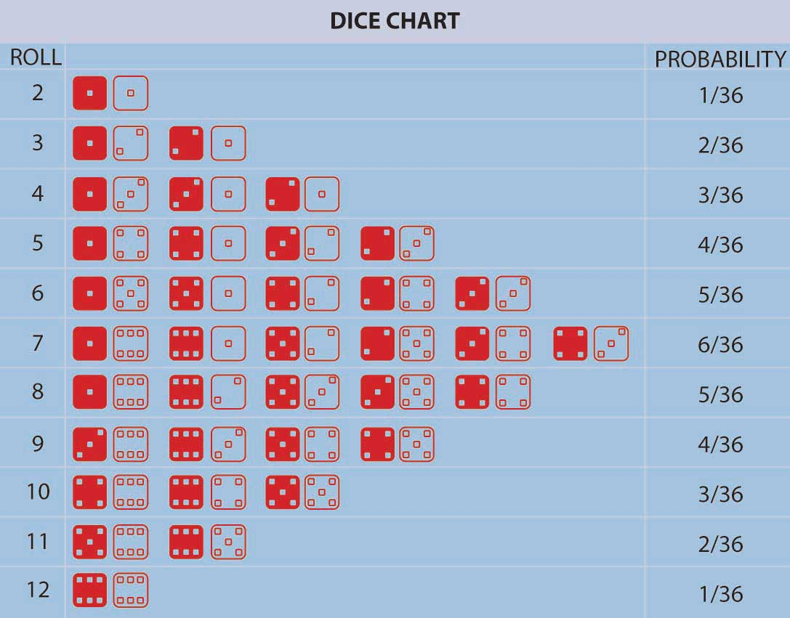

Random numbers are the most important ways in which we model noise in real-world processes. The nature of randomness varies according to the actual phenomena that is causing the randomness. For example, if we roll a dice, the result can vary between 1 to 6, where all numbers are equally likely. But it we take the sum of rolling two dice, getting a 2 or 12 is less likely than getting a 7. See the image below to have an intuitive understanding as to why this happens. The variations in randomness is modeled using probability distribution functions or probability density functions.

Rolling 2 dice

Nature has its ways of generating randomness. However, computers are designed to be deterministic and hence generating randomness is not a simple task. In this experiment, we will try to gain an understanding of random numbers and how we can generate randomness of different properties (distributions). You need to carefully go through the introduction to random numbers and densities before attempting this experiment.
